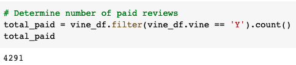
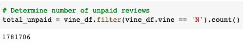
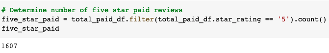
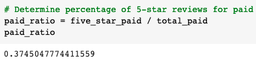
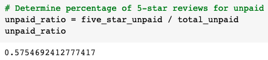

# Amazon_Vine_Analysis

## Overview of the analysis

The purpose of this challenge was to analyze Amazon vine review data to determine if reviewers that are apart of the Vine program show bias. Reviewers who are apart of the Vine program are paid a small fee to write a review for a specific product. We were given access to approximately 50 Amazon review datasets but we ran the analysis on just one. The dataset I chose was video games. We created an AWS RDS instance, loaded the transformed data into pgAdmin. Then we extracted a CSV and used PySpark to make calculations to determine if there was bias.

## Results

- How many Vine reviews and non-Vine reviews were there?

As shown in the screenshot above, there were 4,291 Vine reviews.

As shown in the screenshot above, there were 1,781,706 non-Vine reviews.

- How many Vine reviews were 5 stars? How many non-Vine reviews were 5 stars?

As shown in the screenshot above, there were 1,607 five star Vine reviews.

As shown in the screenshot above, there were 1,025,317 five star non-Vine reviews.

- What percentage of Vine reviews were 5 stars? What percentage of non-Vine reviews were 5 stars?

As shown in the screenshot above, 37.45% of Vine reviews were 5 stars.

As shown in the screenshot above, 57.55% of non-Vine reviews were 5 stars.

## Summary

Based on the data that we collected we have determined that there isn't a positivity bias for Vine program reviewers. This is because there was approximately 20% more five star reviews for non-Vine program users than Vine program users. In order to come to a more accurate conclusion, we could run this analysis with the other 50 review data sets from Amazon and see if this result is consistent. Another analysis that could be run to determine if there is a positivity bias is to compare reviews for other star levels and not just 5 stars. That way we could get a more accurate reading of whether or not bias is present. 